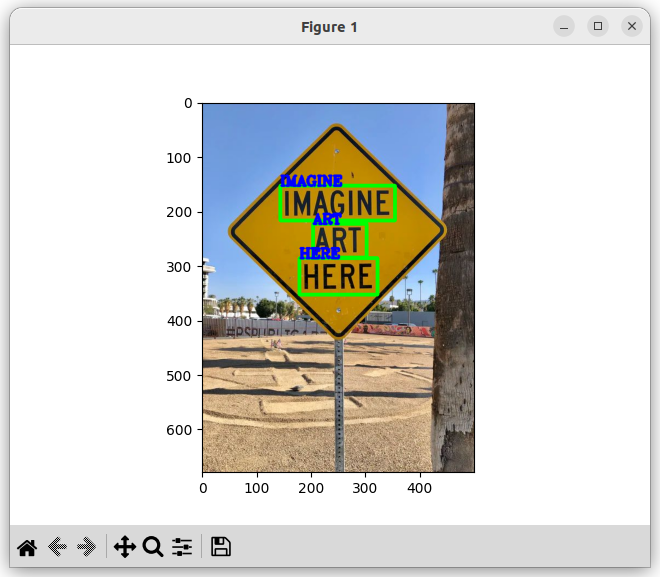
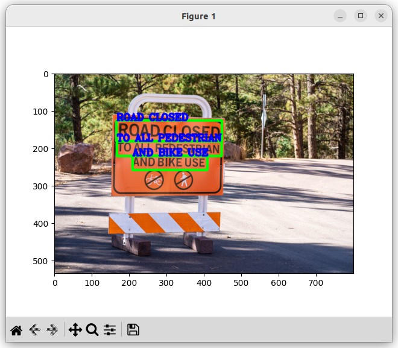
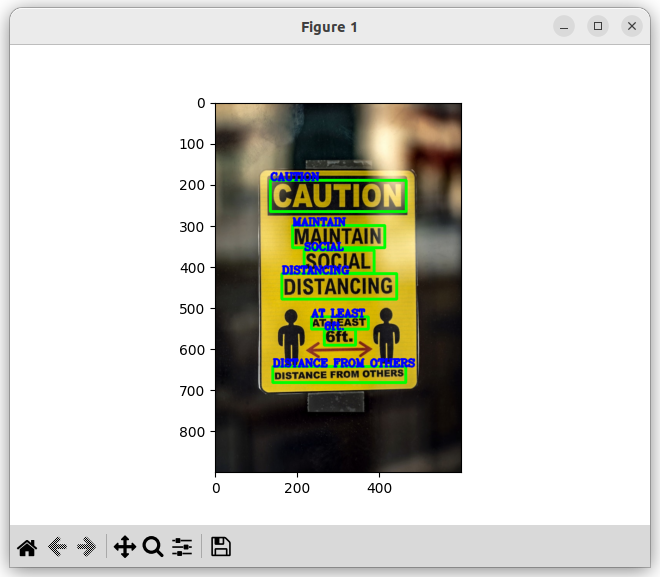

# text-detection-ocr-opencv-python

Text detection with Python, Opencv, and EasyOCR

# how to install and run

Make sure that you have Python 3.8+ installed

$ pip install -r requirements.txt

put images into ./data folder

main.py file, 9th line: image_path = './data/test.jpeg' - path to an image to read

$ python main.py

# examples

